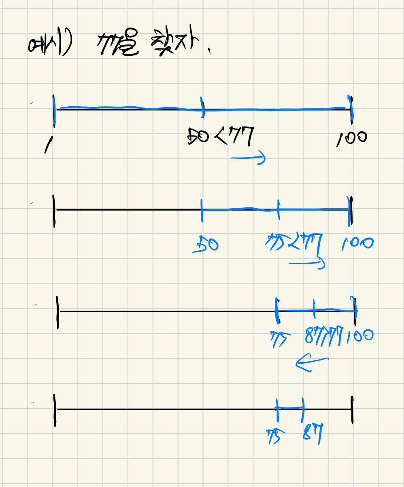

## 그대로 출력하기
### 접근 방식
1. 테스트케이스 만큼 반복한다.
2. 수첩1, 수첩2를 정렬한다.
3. 수첩2를 순회하면서 수첩1에 포함되어있는지 이진 검색으로 찾는다.

### 배운 점
- 이진 검색
   - 시간 복잡도 : O log n
   - 정렬된 배열에서 값을 찾아내는 알고리즘
   - 1억개의 item도 27번만에 찾아낼 수 있다.
   - 중간 값을 기준으로 탐색 범위를 절반씩 줄인다.

